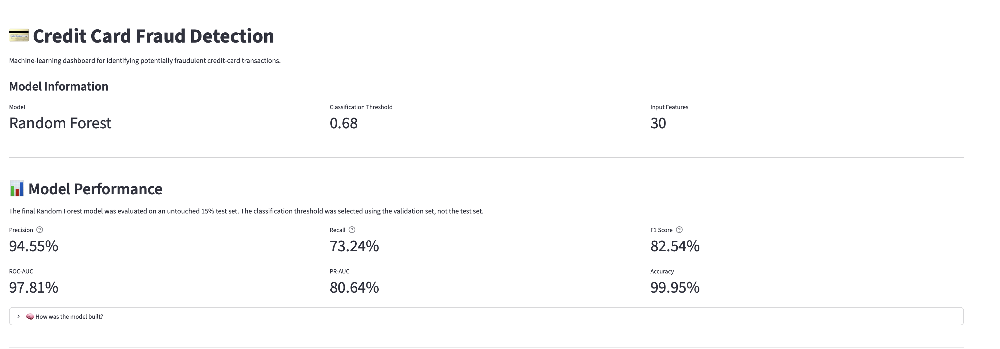
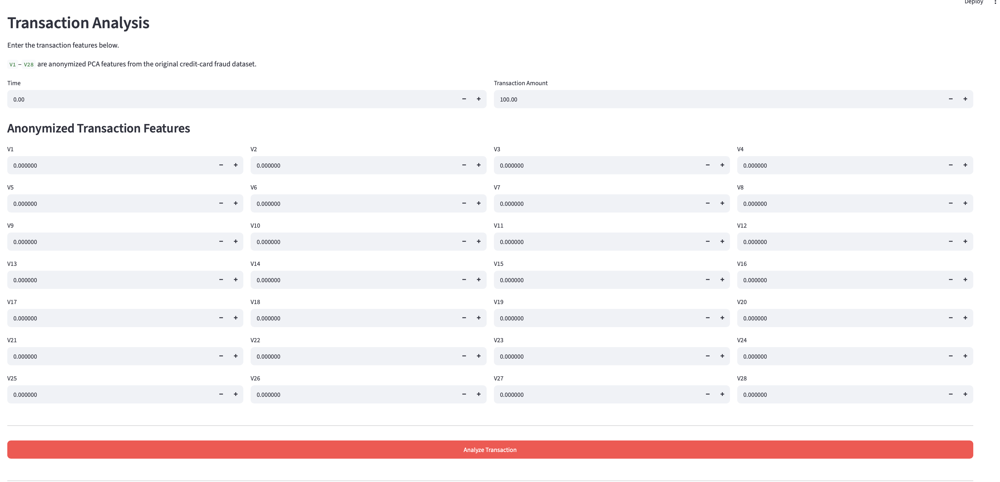
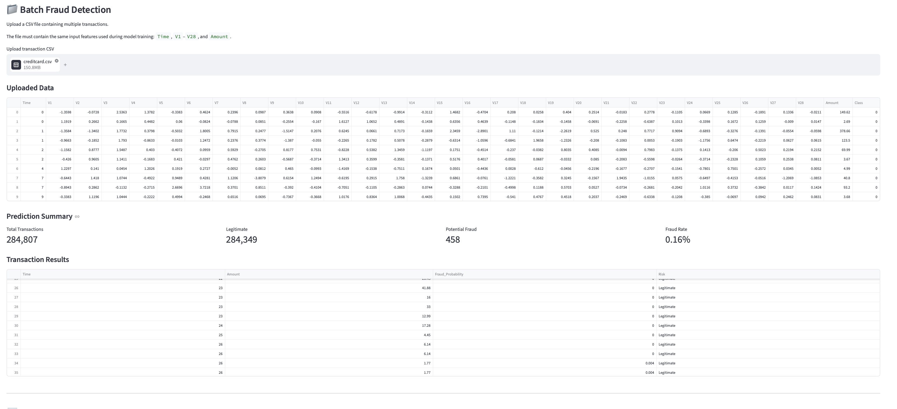
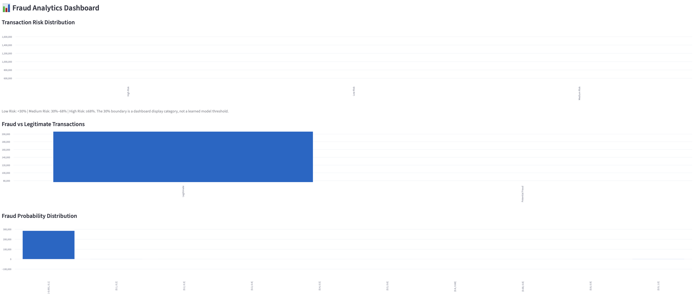
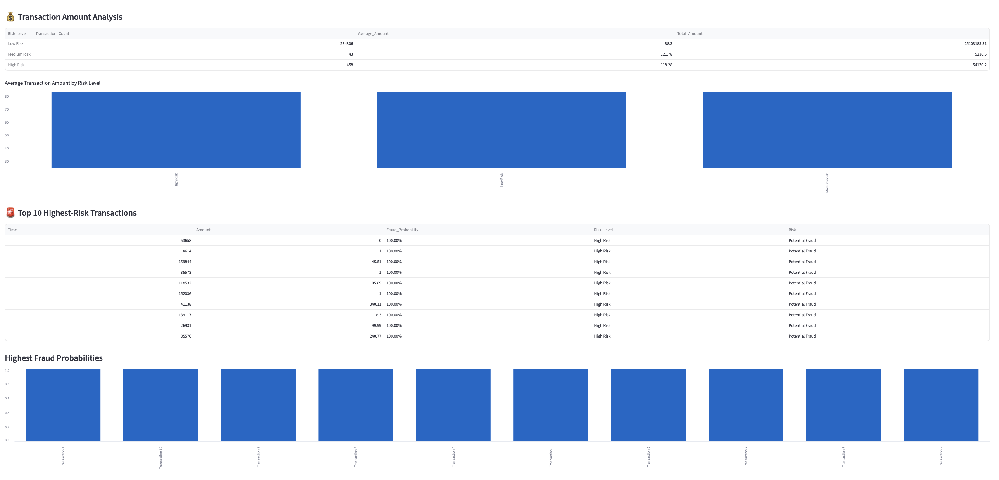
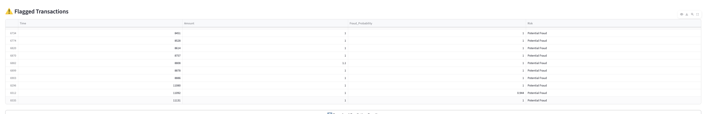

# 💳 Credit Card Fraud Detection

An end-to-end machine learning project for detecting potentially
fraudulent credit-card transactions using **Python, scikit-learn, SMOTE,
Random Forest, XGBoost, and Streamlit**.

The project covers data quality checks, exploratory analysis,
class-imbalance handling, model comparison, validation-based model
selection, threshold optimization, final evaluation on an untouched test
set, model persistence, and an interactive Streamlit dashboard for
single and batch transaction analysis.

## 🎯 Project Objective

Credit-card fraud detection is a highly imbalanced binary-classification
problem. The objective of this project is to build a machine-learning
workflow that can identify fraudulent transactions while controlling
false fraud alerts.

Because legitimate transactions heavily outnumber fraudulent
transactions, **accuracy alone is not an appropriate measure of model
quality**. The project therefore emphasizes **Precision, Recall, F1
Score, ROC-AUC, and especially PR-AUC**.

## 📂 Dataset

The project uses the **Credit Card Fraud Detection** dataset commonly
distributed through Kaggle.

The modeling dataset contains:

-   **284,807 transactions before duplicate removal**
-   `Time`
-   anonymized PCA features `V1`--`V28`
-   `Amount`
-   target variable `Class`
-   `Class = 0`: legitimate transaction
-   `Class = 1`: fraudulent transaction

The raw CSV is intentionally excluded from Git because of its size.
Place `creditcard.csv` inside the `data/` directory before running the
notebook.

## 🧹 Data Preparation

The notebook performs the following preparation steps:

1.  Validates the expected dataset schema.
2.  Checks missing values.
3.  Detects and removes duplicate transactions.
4.  Separates features from the `Class` target.
5.  Uses a stratified **70% / 15% / 15%** train-validation-test split.
6.  Standardizes `Time` and `Amount`.
7.  Applies **SMOTE only to the training data**.

Validation and test data remain untouched by SMOTE to avoid data
leakage.

## 🧠 Machine Learning Models

Three classification algorithms are compared:

  -----------------------------------------------------------------------------
  Model          Validation   Validation   Validation   Validation   Validation
                  Precision       Recall           F1      ROC-AUC       PR-AUC
  ------------ ------------ ------------ ------------ ------------ ------------
  **Random       **0.9310**       0.7606   **0.8372**       0.9597   **0.8409**
  Forest**                                                         

  XGBoost            0.4375       0.7887       0.5628       0.9733       0.7980

  Logistic           0.0492   **0.8873**       0.0933   **0.9735**       0.6986
  Regression                                                       
  -----------------------------------------------------------------------------

**Random Forest** was selected because it achieved the strongest
validation PR-AUC and a strong precision-recall balance.

## 🎚️ Threshold Optimization

The default classification threshold is `0.50`.

Threshold optimization was performed **only on the validation set**,
resulting in a selected threshold of:

``` text
0.68
```

The test set was not used for model selection or threshold tuning.

## 🏆 Final Test Performance

The selected Random Forest model was evaluated once on the untouched 15%
test set.

  Metric                           Result
  -------------------------- ------------
  Accuracy                     **99.95%**
  Precision                    **94.55%**
  Recall                       **73.24%**
  F1 Score                     **82.54%**
  ROC-AUC                      **97.81%**
  PR-AUC                       **80.64%**
  Classification Threshold       **0.68**

### Interpretation

-   **94.55% precision** means the model's fraud alerts have high
    precision on the final test split.
-   **73.24% recall** means the model detects about 73% of actual fraud
    cases in that split.
-   **82.54% F1** summarizes the balance between precision and recall.
-   **80.64% PR-AUC** is especially informative because fraud is
    extremely rare relative to legitimate transactions.
-   The very high accuracy should not be interpreted alone because of
    the severe class imbalance.

## 🔄 Project Workflow

``` text
Credit Card Transaction Dataset
              │
              ▼
     Data Quality Checks
              │
              ▼
     Duplicate Removal + EDA
              │
              ▼
      Stratified 70/15/15 Split
              │
       ┌──────┴───────┐
       ▼              ▼
 Training Set     Validation Set
       │              │
Scaling + SMOTE       │
       │              │
       ▼              │
Train LR / RF / XGB   │
       │              │
       └──────┬───────┘
              ▼
   Validation Comparison
              │
              ▼
      Random Forest
              │
              ▼
 Threshold Optimization
          0.50 → 0.68
              │
              ▼
     Untouched Test Set
              │
              ▼
      Final Evaluation
              │
              ▼
  Saved Model + Streamlit App
```

## 🖥️ Streamlit Dashboard

The Streamlit application loads the saved preprocessing pipeline and
Random Forest model. It does **not retrain the model** when the
application starts.

Features include:

-   model and threshold information
-   official final-test performance metrics
-   single-transaction fraud prediction
-   fraud probability output
-   batch CSV prediction
-   fraud/legitimate transaction summary
-   low/medium/high dashboard risk categories
-   fraud probability distribution
-   transaction amount analysis
-   top 10 highest-risk transactions
-   flagged-transaction table
-   downloadable prediction results

### Dashboard Overview



### Single Transaction Analysis



### Batch Fraud Detection



### Fraud Analytics



### Highest-Risk Transaction Analysis



### Flagged Transactions



> The dashboard's 30% boundary for "Medium Risk" is a presentation
> category only. The actual fraud classification decision uses the
> validation-selected **0.68 threshold**.

## 📁 Project Structure

``` text
Credit-Card-Fraud-Detection/
├── app/
│   └── app.py
├── data/
│   ├── README.md
│   └── creditcard.csv          # local only / ignored by Git
├── images/
│   ├── dashboard_overview.png
│   ├── transaction_analysis.png
│   ├── batch_prediction.png
│   ├── fraud_analytics.png
│   ├── risk_analysis.png
│   └── flagged_transactions.png
├── models/
│   └── fraud_detection_bundle.joblib
├── notebooks/
│   └── Credit_Card_Fraud_Detection_Final.ipynb
├── src/
├── .gitignore
├── README.md
└── requirements.txt
```

## 🛠️ Technology Stack

-   Python
-   Pandas
-   NumPy
-   Matplotlib
-   Seaborn
-   scikit-learn
-   imbalanced-learn / SMOTE
-   XGBoost
-   SHAP
-   Joblib
-   Jupyter Notebook
-   Streamlit
-   Git / GitHub

## ⚙️ Installation

Clone the repository:

``` bash
git clone https://github.com/chandraAkiran/Credit-Card-Fraud-Detection.git
cd Credit-Card-Fraud-Detection
```

Create and activate a virtual environment:

``` bash
python3 -m venv .venv
source .venv/bin/activate
```

Install dependencies:

``` bash
python3 -m pip install --upgrade pip
python3 -m pip install -r requirements.txt
```

Place the dataset at:

``` text
data/creditcard.csv
```

## 📓 Run the Notebook

Start Jupyter:

``` bash
jupyter notebook
```

Open:

``` text
notebooks/Credit_Card_Fraud_Detection_Final.ipynb
```

Run all cells to reproduce the training workflow and create:

``` text
models/fraud_detection_bundle.joblib
```

## 🚀 Run the Streamlit Application

From the project root:

``` bash
python3 -m streamlit run app/app.py
```

Then open the local address displayed by Streamlit, normally:

``` text
http://localhost:8501
```

## 📤 Batch Prediction CSV Format

The uploaded CSV must contain the same 30 input features used during
model training:

``` text
Time, V1, V2, ..., V28, Amount
```

An additional `Class` column may be present in a demonstration dataset,
but it is not used as a model input.

The application appends prediction information including:

``` text
Fraud_Probability
Prediction
Risk
Risk_Level
```

## 💾 Saved Model Bundle

The deployment bundle stores the complete inference configuration:

-   fitted preprocessing pipeline
-   selected Random Forest model
-   model name
-   optimized classification threshold
-   processed feature names
-   raw input-column order
-   final test metrics

This helps keep notebook evaluation and application inference
consistent.

## 📌 Key Project Takeaways

This project demonstrates:

-   working with a severely imbalanced classification problem
-   preventing leakage by applying SMOTE only to training data
-   using separate train, validation, and test sets
-   comparing multiple machine-learning algorithms
-   choosing a model using PR-AUC
-   optimizing the classification threshold without touching the final
    test set
-   evaluating a model using metrics appropriate for imbalanced data
-   persisting preprocessing and model artifacts
-   building an interactive ML application with Streamlit
-   supporting both individual and batch predictions

## 🔮 Future Improvements

Potential extensions include:

-   probability calibration
-   cost-sensitive threshold selection based on fraud-loss and review
    costs
-   model monitoring and drift detection
-   experiment tracking with MLflow
-   API deployment with FastAPI
-   cloud deployment
-   automated testing and CI/CD
-   explainability for individual predictions
-   time-aware validation where suitable transaction chronology is
    available

## ⚠️ Disclaimer

This project is intended for **educational and portfolio demonstration
purposes**. Its predictions should not be used as the sole basis for
real financial or fraud-investigation decisions.

## 👤 Author

**Chandra Akash Kiran**

Data Analytics • Machine Learning • Generative AI

GitHub: `chandraAkiran`
